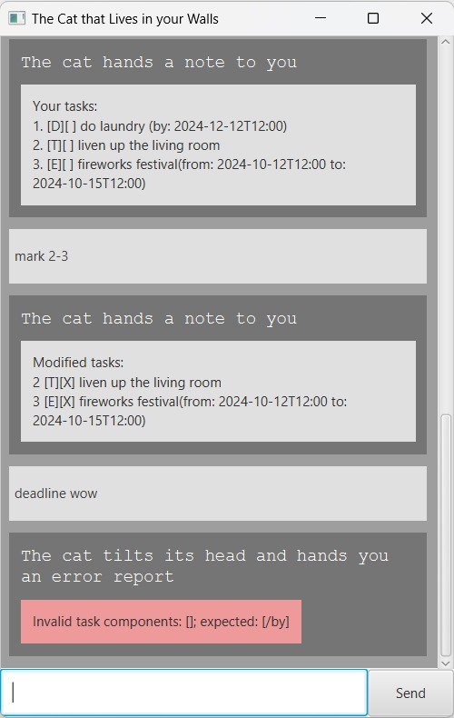

# The Cat that Lives in your Walls User Guide



The cat that lives in your walls is a program that is
about a cat that helps you manage your tasks and is
incidentally living in your wall.

## Quick start

Install the latest Java runtime from oracle and double-click the
jar file (or run from the command line with `java -jar cat.jar`).

## Features
* Saves all your tasks to a file in the same directory called `cat.state`
* Error handling for most common errors (I've got a midterm alright?)

## Usage

#### Terminology
* Words wrapped in <> represent required parameters.
* Words wrapped with [] represent optional parameters.
* `...` after a parameter means that the command expects
a variable number of the parameters.

In this guide, the examples are gives as such.
```
> input
output
```

All dates and times have to be in put in the format `dd/mm/yy hhmm`

### Adding todos: `todo`

Adds a todo to the task list.

Format: `todo <description>`

Example:
```
> todo Figure out what the meaning of life is
Added task: Figure out what the meaning of life is
```

### Adding deadlines: `deadline`

Adds a task with a deadline to the task list.

Format: `deadline <description> /by <date and time>`

Example:
```
> deadline do laundry /by 13/06/2024 1500
Added task: do laundry; due by Thu, 13 June 24 at 03:00pm
```

### Adding events: `event`

Adds a task that spans for a given time range to the task list.

Format: `event <description> /from <date and time> /to <date and time>`

Example:
```
> event Chinese New Year /from 12/02/2024 0000 /to 13/02/2024 2359
Added task: Chinese New Year; starts from Mon, 12 February 24
at 12:00am and ends at Tue, 13 February 24 at 11:59pm
```

### Marking or unmarking tasks as done: `mark`, `unmark`

Sets the tasks with the given indices as done if the command is `mark`
and not done if the command is `unmark`.

Format: `mark [index]... [startIndex-endIndex]...`

The indices are the numbers given for the tasks in `list`.
The ranges are inclusive on both sides. The format is the same for `unmark`.

### Deleting tasks: `delete`

Removes the tasks with the given indices from the task list.

Format: `delete [index]... [startIndex-endIndex]...`

The indices are the numbers given for the tasks in `list`.
The ranges are inclusive on both sides.

### Finding tasks: `find`

Finds the tasks containing the given string.

Format: `find <string>`

### Getting help: `help`

Gives a short blurb listing out all of the valid commands
and their parameters.

Format: `help`